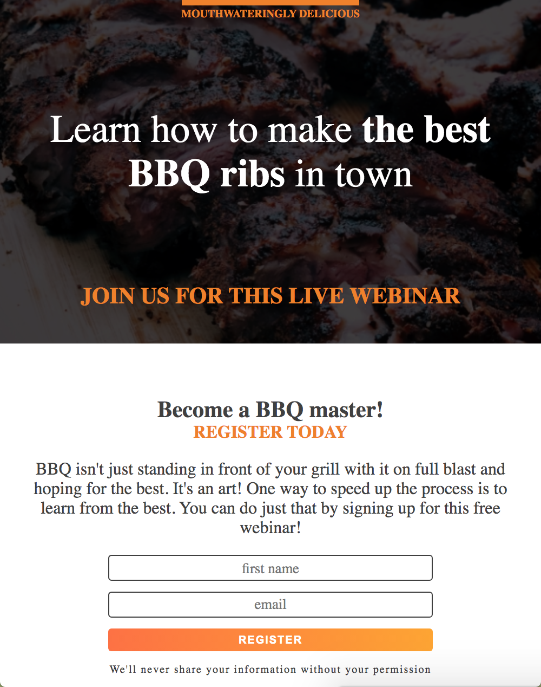
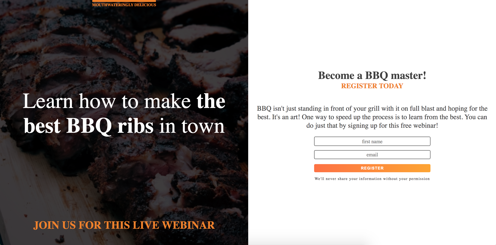

## BBQ Splash

A responsive webpage showcasing below CSS properties and my love for food 😉

- Controlling elements using `flex`  
- Making the page responsive using `@media` query  
- Scaling the elements dynamically using `transform`  
- Controlling the transformation time using `transition`  
- Controlling text manipulation using `text-transform`
- Making versatile background using `linear-gradient`

What to expect when you decide to take a look and run index.html

### iPad view 
Setting the min width at 675px to accomodate the fonts

### Desktop View

